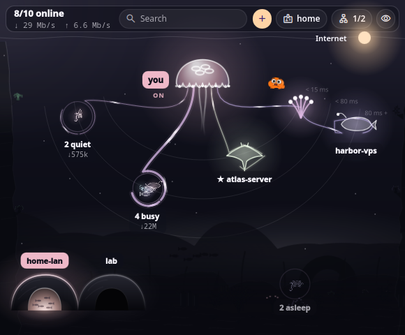
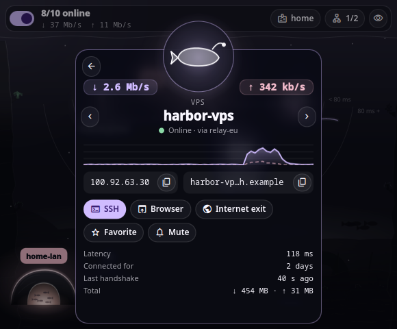
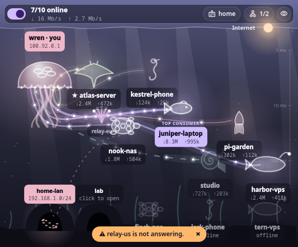
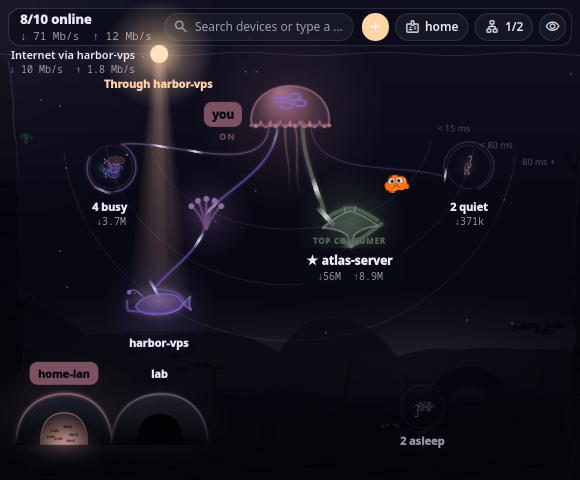

# Abyss

Your [NetBird](https://netbird.io) mesh as a glowing deep sea, for [DankMaterialShell](https://github.com/AvengeMedia/DankMaterialShell).

You are the giant jellyfish. Every peer is a creature floating at the depth of its latency, tied to you by a tentacle that carries its live traffic: the more it uses, the thicker and brighter the tentacle, with pulses of light running toward you (download) or toward it (upload). Who uses the most is marked at a glance, and every creature shows its ↓/↑ rate. No clicks needed to read your network.

> **New in 0.2.0:** a magnetic lens, automatic groups you dive into, a sonar fan, creatures you can grab, a frosted card like Orbit, a living reef under the pointer light, and a fishbowl desktop widget. Still on a **made-up demo mesh**; reading the real NetBird daemon comes next.



## What you see

| In the deep | Means |
|---|---|
| The jellyfish (you), lit | Connected. Click it to connect or disconnect (or sign in / start the service) |
| A creature | A peer; its species says what it is: manta = server, lantern whale = VPS, fish = laptop, nautilus = desktop, seahorse = phone, squid = Raspberry Pi, turtle = NAS |
| Depth | Latency, on a log scale (1–320 ms, gauge on the right) |
| Tentacle width and pulses | Live traffic of that peer; **TOP CONSUMER** marks the biggest |
| A coral lantern on a tentacle | The relay a peer goes through; blinking orange = the relay stopped answering |
| A creature asleep on the floor | Offline |
| Caves on the floor | Networks and routes; click one to turn it on or off |
| The light of the surface | Internet. Drag it onto a peer to use it as exit node, drop it in the water to stop. Rest it on a group to open it, then leave it on a member, or in the middle for the whole group |



**Click a creature** to open its card: live rates and a 60-second curve, copy its IP or name, SSH, open in the browser, use as exit node, favorite, mute, latency, connected since, last handshake, totals, networks it opens. <kbd>←</kbd> <kbd>→</kbd> (or the ‹ › arrows) step to the previous or next device without leaving the card.

**Right-click** a creature or a group to make your own groups: add a peer to a group, start a new one, rename, ungroup, or keep an automatic group as yours. Your groups come first and keep their members. Right-click **the jellyfish** (you) to connect or disconnect, switch profile, or show and hide offline peers.

**Internet through a whole group**: carry the light into a group and let it go in the middle. It stays there, tied by a tentacle to the member lending the Internet (NetBird uses one exit node at a time) and by dashed lines to the ones ready to take over: if that member goes offline, the next best one (direct first, then the lowest latency) takes over by itself. Drag the light out of the group to stop.

**Type a name** to find a peer (favorites first), <kbd>Enter</kbd> opens its card, <kbd>Esc</kbd> closes.

| Relay down | Exit node, light theme |
|---|---|
|  |  |

## Surfaces

- **Bar**: a small jellyfish with the number of peers online. Click opens the deep, right click connects or disconnects.
- **Control Center**: a NetBird tile (toggle) with the deep underneath.
- **Desktop**: a round fishbowl on your wallpaper, with a sandy bed, glass and a water line; the deep lives inside it. It stays still until the pointer is over it. Who is online and the live totals are scratched into its glass, in front of the sand; choose which screens show it in the settings.


## Keyboard and scripts

```sh
dms ipc call abyss status          # "connected · 8/10 online"
dms ipc call abyss toggle          # or connect / disconnect
dms ipc call abyss copy <peer>     # copies the peer's IP
dms ipc call abyss ssh <peer>      # SSH in your terminal
dms ipc call abyss exit <target>   # Internet through a peer or one of your
                                   # groups; "off" to stop
dms ipc call abyss demo <state>    # demo only: connected, disconnected, connecting,
                                   # needsLogin, stopped, relayDown, relayUp
```

## Settings

Which screens show the desktop bowl (all by default), how groups open (on hover and click by default, or only one of them; carrying the Internet light always opens them), offline peers on the floor, light pulses, keeping the desktop alive, notifications when a peer comes or goes (off by default; muted peers stay quiet), and the terminal used for SSH (automatic by default).

## Lightweight

- Nothing runs while no view is open: no timer, no reads.
- While a view is open, one 30 Hz timer moves the pulses and the marine snow; only this window redraws, never the whole shell. Backgrounds are painted once.
- *Reduce motion* turns every movement off.

Measured numbers will be added here before the first stable release.

## Privacy

- The plugin never talks to the network itself and has no telemetry.
- Peers, addresses and traffic stay in memory for the session; nothing is written to disk except your settings (favorites, muted peers, your groups and the group carrying the Internet included).
- Copy uses DMS's clipboard, SSH opens your own terminal.

## Install

```sh
git clone https://github.com/lung595/Abyss ~/.config/DankMaterialShell/plugins/Abyss
```

Then enable **Abyss** in DMS Settings → Plugins, and add it to the bar, the Control Center or the desktop.

## Development

```sh
gjs tests/mesh.test.js && gjs tests/layout.test.js && gjs tests/terminal.test.js
scripts/preview/render.sh connected "$PWD/out.png"   # offscreen renders from the demo mesh
```

## Changelog

### Unreleased (0.3.0)

- **Livelier animals**: between trips every creature now has its own life — the fish beats its tail and wanders, the manta flaps its wings, the squid squeezes and jets upward, the seahorse sways upright, the turtle paddles, the whale and the nautilus roll slowly — and now and then the ones that can turn look the other way. Inside an open group the members live too (they were still). Calmer asleep, still with *Reduce motion*, and nothing runs while nobody looks: it rides the scene's existing clock, moving the shapes without repainting them (idle CPU unchanged: 3.7 % vs 3.6 % of one core, same session).
- **Your own groups**: right-click a creature or a group to add it to a group, start one, rename, ungroup, or keep an automatic group. They come first and never reshuffle.
- **Internet through a whole group**: drop the light in the middle of a group; it stays there, tied to the member lending the Internet, and the next best member takes over if that one goes offline. Drag it out of the group to stop. Also `dms ipc call abyss exit <group or peer>`.
- **Carry the Internet into groups**: resting the light on a group opens it (the groups hold still meanwhile), you can then leave it on any member; carrying it out of the bubble closes it.
- **Setting "Open groups"**: on hover and click (default), on hover only, or on click only.
- **Choose the screens for the desktop bowl**: a "Desktop" section at the top of Abyss's settings (all displays, or pick them one by one), from the Plugins page or from Settings › Desktop Widgets.
- **No bar over the bowl**: who is online and the live totals are cut into the glass in front of the sand, like an engraving (lit lower edge, shadowed upper edge, a few scratches). Click the jellyfish to connect; right-click it to connect or disconnect, switch profile, or show and hide offline peers (everywhere, not just in the bowl). The bar stays in the bar popout and the Control Center.
- **Card**: received and sent now sit either side of the creature's medallion, on small cards in their own colours (received in the peer's colour, sent in yours, as the curve below), and the address and the name share one line, each with its copy button.
- **TOP CONSUMER** is told by its caption alone; its label no longer changes colour.
- **Fixed**: a click, or resting the pointer, opened a creature or a group a hand-width away; it now takes the pointer being on it (the lens still aims from afar).

### 0.2.0 — 2026-09-27

- **Lens**: a soft magnetic lens follows the pointer and gently enlarges what it lights; the scroll wheel sets its strength. The pointer is a warm light in a darker, more immersive deep.
- **Groups**: never more than 5 things on screen (3–10 in settings). Busy, struggling and favourite peers stay alone; the rest gather in automatic groups. Rest the pointer on one and the camera glides and zooms towards it until it opens in the middle of the view; move away and it glides back. Type anywhere to find, and everything else blurs.
- **Sonar fan**: the jellyfish sits at the top and peers fan out below it, farther when slower, with sonar rings in ms.
- **Grab and release**: drag any creature; it springs back to its place, like Orbit.
- **Peer card like Orbit**: the card rises and the creature dives toward it and rides up with it; on close it swims straight home.
- **Frosted glass card**: the deep shows through, blurred once as the card opens (nothing is re-blurred while it stays open). Every device gets the same compact height; the details scroll inside.
- **Step through devices** with ‹ › or <kbd>←</kbd> <kbd>→</kbd>: the circle stays still while the creature, the name and the status crossfade in place, and the previous creature fades back home.
- **The pointer light reveals the scenery** instead of glowing: a soft disc under the lens uncovers a reef in depth (far hills in a faint distant haze, rock spires and an arch, cliffs, the floor) with a little parallax, glowing coral tips, swaying kelp and gorgonians, sponges, anemones and a small shoal of fish passing now and then. Muted on purpose; it costs nothing measurable.
- Thinner traffic tentacles (a thread when idle, a ribbon when busy) and calmer motion.
- The jellyfish now has loose threads of light; each linked peer takes one over. Its bell fades smoothly between asleep and awake.
- Caves (routed networks) always glow a little, and burn when on. Their thread to the gateway only shows while you hover them, and leaves from above the name.
- **The desktop widget is a fishbowl**: round glass with a rim, highlights and a soft shadow on your wallpaper, water tinted by your theme and a bed of sand at the bottom. The deep fills the whole belly of the bowl without spilling past the glass. The top bar only shows while you use it. A group opening inside the bowl melts into the water at its edges.
- **A readable card in the bowl**: opening a device darkens the bowl's water and fades its glass behind the card, instead of a dark box spilling past the glass.
- **Inside a group**: the rest of the deep darkens and fades around it, and the group sits in a lit pool, its home; round it the water bends like a lens instead of a drawn circle. The opening animation is unchanged.
- **Steadier fan**: devices keep their side when their traffic changes, instead of swimming across the view; caves keep clear of them.
- **The top consumer label stops flickering**: its filled, coloured label only moves to another device when that one is clearly busier (30 % more).
- Fixed: a traffic spike each time the view opened; grabbing moved only the tentacle.
- Still to come: see the [Roadmap](#roadmap).

### 0.1.0 — 2026-09-26

- First preview: the whole deep (jellyfish, creatures by device type, traffic tentacles, relays, networks, exit node by drag, peer card, type to find) on a made-up demo mesh.
- Bar pill, Control Center tile and desktop widget; IPC; notifications; SSH in the terminal of your choice.

## Roadmap

No promises, no dates. Everything here was asked for and is not in a release yet.

### Next

- **Tentacles that hold their device**: the tip wraps around the creature, as if the jellyfish really held it.
- **The card first, then the creature**: both finish landing at the same moment.
- **Rename a group**: click its name at the top of the group view; a small ⚙ opens its settings.
- **The jellyfish as the only on/off switch**: the extra toggle goes, and a small ON/OFF word sits by the jellyfish.
- **A cleaner layout**: one sector per relay, so no tentacle or lantern ever hides a device or a label.
- **Shoals**: the creatures of a group swim together like a real school of fish (only while you watch).
- **A goldfish companion** in every view (bar popout, Control Center, desktop): it waves when you click it and lives its life, eats, sleeps with little *z z z*, and cleans the bowl now and then. Still while nobody looks.
- Measured CPU cost while a view is open, and fresh screenshots.
- Naming a group types in the view: it needs keyboard focus, which the desktop widget may not get (the name stays "Group n" there; rename it from the popout).

### Later

- **Smart search bar**: understands words and synonyms, not only names.
- **Smart tags**: added automatically (from the name, services, machine type) or by hand.
- **Use it from the launcher (Super+Space)**: `abyss >100ms`, `abyss proxmox`, `docker`… with a live preview.
- **Read the real NetBird daemon** (`netbird status --json`, only while a view is open), connect, disconnect, sign in, networks and profiles through the `netbird` CLI.
- Bar count kept fresh without polling while nothing is open.
- Bar pill options: icon only, with peers online, or with the total rate.
- Show online peers only, or all of them.
- Ping a peer from its card, on demand only (never in the background).
- Open the admin console, a reconnect shortcut, the daemon version.
- A compact list for very large meshes (30+ peers).
- Maybe, if asked: a one-click debug bundle for support, and client settings (SSH server, Rosenpass, connect at startup).

## Credits

- The idea of a NetBird plugin for DMS comes from **NetbirdStatus** by [Dadangdut33](https://github.com/Dadangdut33), in [dms-plugins](https://github.com/Dadangdut33/dms-plugins). Thank you!
- The fishbowl desktop widget (and the goldfish to come) is a nod to Gumball and Darwin's bowl in *The Amazing World of Gumball* (Cartoon Network); everything here is drawn from scratch, no character is reproduced.
- Built on [DankMaterialShell](https://github.com/AvengeMedia/DankMaterialShell) and [Quickshell](https://quickshell.org).

## License

MIT © lung595
