# Abyss: user guide

Everything Abyss can do, in detail. To install it and add a widget, see the [README](../README.md#getting-started).

Every refusal in Abyss says why in a short note, with a GitHub mark that opens the matching section of the docs.

## Contents

- [Widgets](#widgets)
- [Connect and disconnect](#connect-and-disconnect)
- [Open a peer's card](#open-a-peers-card)
- [Open a group](#open-a-group)
- [Make your own groups](#make-your-own-groups)
- [Internet through a peer](#internet-through-a-peer)
- [Internet through a whole group](#internet-through-a-whole-group)
- [Turn a network on or off](#turn-a-network-on-or-off)
- [Find a peer](#find-a-peer)
- [The list](#the-list)
- [Ping](#ping)
- [Connect to a peer](#connect-to-a-peer)
- [Search and commands](#search-and-commands)
- [Add a device](#add-a-device)
- [Join a mesh](#join-a-mesh)
- [Let peers SSH in](#let-peers-ssh-in)
- [Send a file](#send-a-file)
- [From the launcher](#from-the-launcher)
- [The Abyss app](#the-abyss-app)
- [Settings](#settings)
- [Privacy](#privacy)
- [Performance](#performance)

## Widgets

- **Bar**: a small jellyfish with the number of peers online. Click opens the deep, right click connects or disconnects.
- **Control Center**: a NetBird tile (toggle) with the deep underneath.
- **Desktop**: a round fishbowl with a sandy bed, glass and a water line; the deep lives inside it. It stays still until the pointer is over it. Who is online and the live totals are written in a fine line of coloured sand. Choose its screens in the settings.

| Desktop fishbowl | Control Center |
| --- | --- |
| 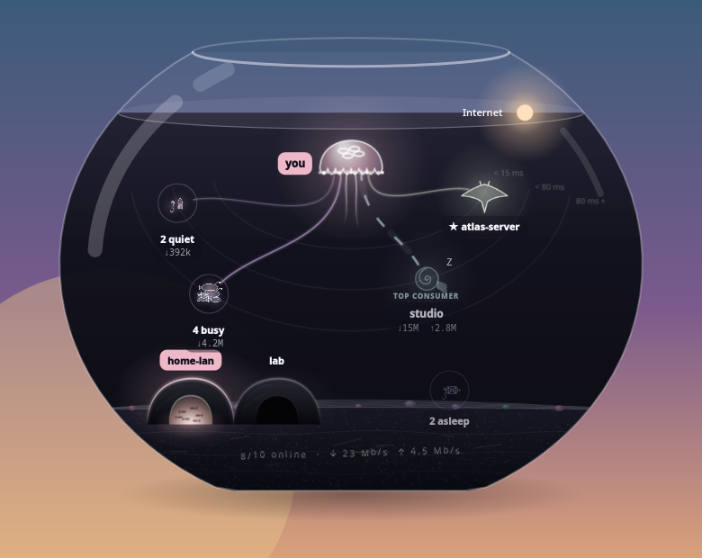 | 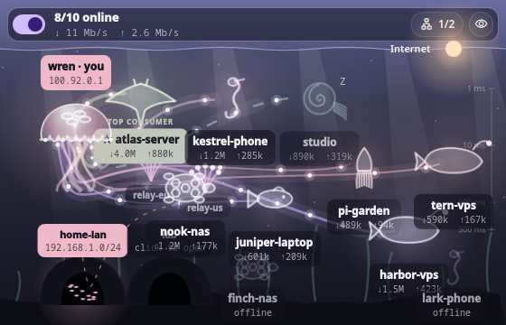 |

## Connect and disconnect

Click **the jellyfish** (you) to connect or disconnect: it is the only switch, and the small ON / OFF under "you" says where you stand; if NetBird needs it, the same click signs you in or starts the service. Right-click it for more: connect or disconnect, switch to the next profile, show or hide offline peers, open the admin console (NetBird Cloud's dashboard, or your management server's address when self-hosted). Pointing at it says your address and which NetBird version runs. From the bar, a right click on the small jellyfish does the same, and so does `dms ipc call abyss toggle`.

## Open a peer's card

Click a creature. Its card rises from the bottom and the creature flies onto it: live rates and a 60-second curve, copy its IP or name, SSH, open in the browser, use it for Internet, favorite, mute, latency, connected since, last handshake, totals, networks it opens. Click outside it or press <kbd>Esc</kbd> to close.

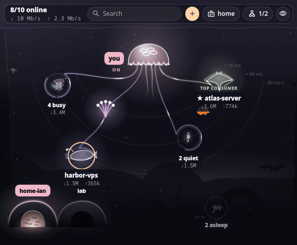

<kbd>←</kbd> <kbd>→</kbd> (or the ‹ › arrows) step to the previous or next device without leaving the card.

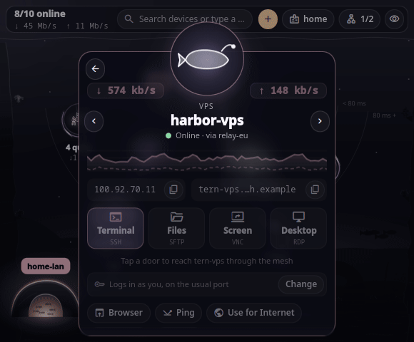

## Open a group

Peers that look alike swim together as a shoal ("3 busy", "2 quiet"). Rest the pointer on one, or click it: the camera glides in and the group opens in the middle. Move the pointer away to come back. The **Open groups** setting chooses how: on hover and click (default), hover only, or click only.

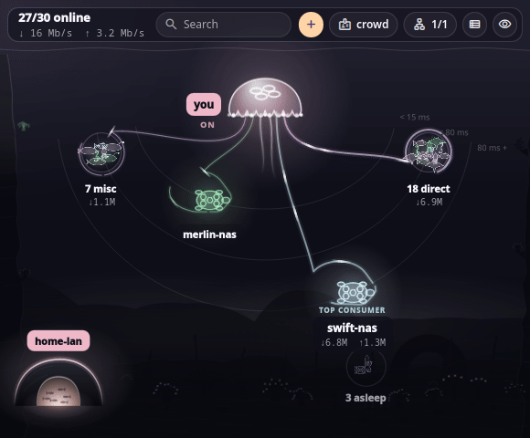

## Make your own groups

Right-click a creature or a group: add it to one of your groups, start a new one, rename it, ungroup it, or keep an automatic group as yours. Your groups come first and never reshuffle. With a group open, click its name at the top to rename it; the small ⚙ beside the name opens the same menu as a right click.

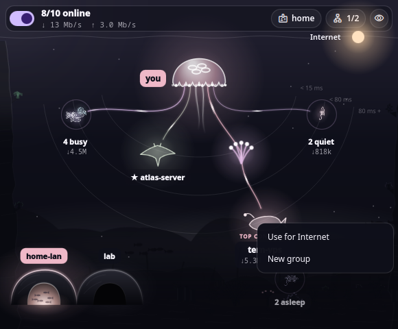

## Internet through a peer

The light at the surface is your Internet. **Drag it onto a peer** and all your Internet traffic goes out through that peer; a soft beam falls from the light onto it. Drag the light back to the surface, or drop it in open water, to go out directly again. <kbd>Esc</kbd> while carrying puts it back. Resting it on a group opens the group, so you can leave it on a member.

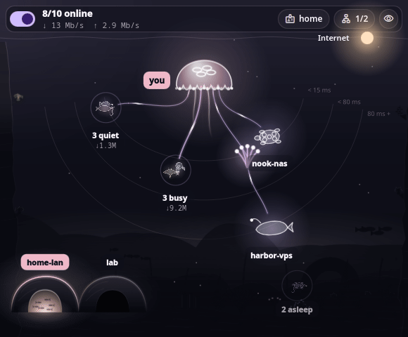

**Only a peer that offers an exit node can lend Internet** (NetBird's rule). NetBird does not say which peer serves an exit route until it is in use, so **name the route after its peer** (`exit-atlas` for *atlas*); a route named after no peer is listed by its own name at the bottom of the light's menu: choose it once and Abyss remembers, in your settings, which peer carries it. While you carry the light, the others step back and, over one of them, the light says so; drop it there anyway and it bounces home with a note. To let a device lend Internet, turn it into an exit node in NetBird's dashboard: *Network Routes* › *Add route* › *Exit node*, see [NetBird's guide](https://docs.netbird.io/how-to/configuring-default-routes-for-internet-traffic).

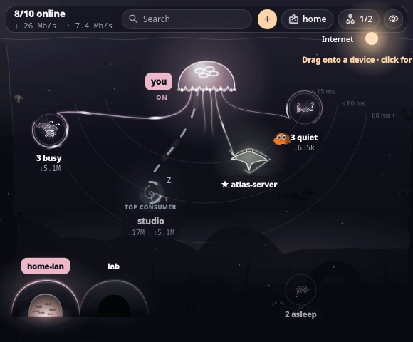

**Click the light** instead of dragging it for the same choice as a list: your groups as folders (click a name for the whole group, its arrow to pick one member), then the other peers that can lend, quickest first, and "Stop". A small turning sun marks the one in use. Right-clicking a peer offers "Use for Internet" too.

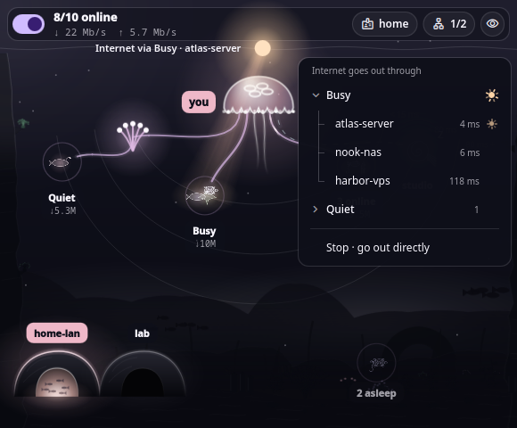

## Internet through a whole group

Carry the light into one of your groups and let it go in the middle. It stays there, tied by a tentacle to the member lending the Internet (NetBird uses one exit node at a time) and by dashed lines to the ones ready to take over: if that member goes offline, the next best one (direct first, then the lowest latency) takes over by itself. Take the light from the middle and drop it on one member to use only that one; drag it out of the group to stop.

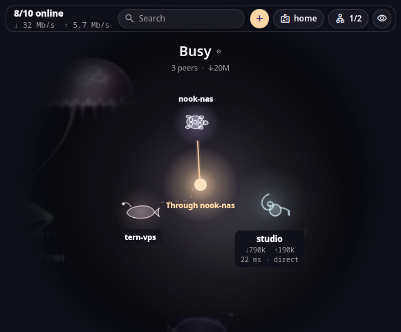

## Turn a network on or off

The caves on the floor are your networks and routes. Click one to turn it on or off, or open the list from the network button at the top.

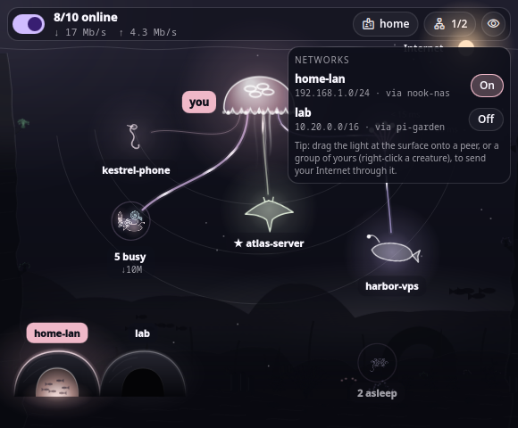

## Find a peer

Just type a name: the deep keeps the matches (favorites first) and dims the rest. <kbd>Enter</kbd> opens the first one's card, <kbd>Esc</kbd> clears.

Words work too, in English or French, and they combine (`slow nas`, `phones offline`): a kind (`phone`, `server`, `nas`, `vps`, `pi`, `laptop`, `desktop`) with its usual names (`iphone`, `proxmox`, `synology`, `hetzner`, `macbook`…), a state (`online`, `offline`, `direct`, `relay`, `eu`), `exit` (can lend Internet), `new` (online for under an hour), `busy`, `quiet`, `slow`, `fast`, or a speed (`>100ms`, `<20ms`). Letters in order find a name (`hrbr` finds *harbor*).

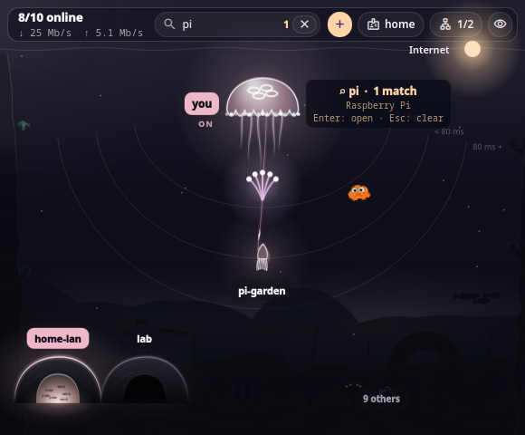

## The list

With 12 peers or more, a list icon appears in the top bar: every peer as one line (name, kind, relay, traffic, latency), online first and the closest first. It follows the search (type to narrow it) and *Show offline peers*; click a line for the peer's card, <kbd>Esc</kbd> to close.

## Ping

A peer's card has a **Ping** button: three echoes to its address, and a toast with the average, the best and worst time and how many answered. It runs only when you ask (also `dms ipc call abyss ping <peer>`); Abyss never pings by itself. In the test lab it says what the made-up mesh claims.

## Connect to a peer

A peer's card has four doors, each with a plain line saying what it opens:

- **Terminal**: SSH in your own terminal (the *Terminal for SSH* setting).
- **Files**: SFTP in your file manager (`gio` or `xdg-open`).
- **Screen**: VNC (`remmina`, `vncviewer` or `krdc`).
- **Desktop**: RDP (`xfreerdp`, `remmina` or `krdc`).

Abyss knocks on the device's port first. A device that does not answer, or a viewer that is not installed, gets a toast that says why and gives the command to copy (sshd, Termux, Remmina for your distribution).

The card also shows the **login**, user and port, and changes it in place. A phone running Termux offers "Use 8022" in one click. From the command line: `dms ipc call abyss link <peer> <user|-> <port|->`. SSH and Files use that login.

## Search and commands

The search bar stays at the top, and typing anywhere fills it. While it is empty it shows one-click shortcuts. Type a command (`add`, `share`, `disconnect`, `console`…) and Enter runs the first match. Typing a peer's name or a filter finds peers, as described in [Find a peer](#find-a-peer).

## Add a device

The **+** at the top, the `add` command or the jellyfish's menu opens a step-by-step sheet:

- **This computer**: paste a setup key from the NetBird dashboard (*Setup Keys*). The field shows dots unless you are typing in it, and it is emptied once the device has joined.
- **Your phone**: QR codes for the NetBird app (click to enlarge). When the server is self-hosted, its address is also shown as a QR code. The codes are drawn on your computer; nothing is sent anywhere.
- When the new device appears, Abyss greets it with a burst of bubbles. For an Android phone, the sheet then gives the Termux steps to reach its terminal and files.

## Join a mesh

Joining runs `netbird up` with your setup key. The key is handed to `netbird` through its environment (`NB_SETUP_KEY`), never on the command line, where any program on the computer could read it while it runs. It is never saved, logged or copied. Signing in or joining may take a while, and Abyss waits up to five minutes.

From the command line, give the **path of a file** that holds the key, never the key itself: a key typed in a terminal stays in the shell history.

```sh
k="$XDG_RUNTIME_DIR/nb.key"                  # in memory, readable by you only
read -rs NB_KEY && (umask 077; printf '%s' "$NB_KEY" > "$k"); unset NB_KEY   # paste the key, then Enter: nothing is shown or kept in the history
dms ipc call abyss join "$k"                 # NetBird Cloud
dms ipc call abyss join "$k" https://nb.example.org:33073   # self-hosted
rm -f "$k"
```

`netbird` reads the file itself (`--setup-key-file`). Abyss refuses a key passed directly and links to this section. `dms ipc call abyss leave` signs this device out.

A self-hosted server address must start with `https://`, so the key never travels in clear. In *Add a device*, the key field always shows dots and is emptied when the sheet closes. If you copied the key from NetBird's dashboard, Abyss removes that copy from DMS's clipboard history once the join has worked; an entry you pinned stays.

## Let peers SSH in

Right-click the jellyfish and choose *Let peers SSH in here*, or run `dms ipc call abyss share on|off`. This turns NetBird's own SSH server on this device on or off, so your phone can open a session on your PC.

## Send a file

Abyss sends files and folders to a device with your own `scp`, over the same SSH login as its card (the user and port you saved there). No password is ever asked: it uses your SSH keys or NetBird's SSH access, and says so when that is not enough. Nothing starts until you send, and nothing stays running after.

**Where it lands.** The folder on the device is *Folder files are sent to* in **Settings → Connect → Opening a device**, `~/Downloads` by default (`~` is the device's home). Letters, digits, spaces and `. _ - / @ % + = ,` only; a folder with `..` is refused. The folder must exist on the device.

**Limits.** Up to 100 items and 200 GB at once. Abyss looks at what you picked first, so a missing item or a huge pick is refused before anything leaves.

When a send fails, Abyss says why and what to do:

- **Refused the login**: pick the right user on the card, copy your key to the device (`ssh-copy-id`), or turn on SSH in NetBird for it.
- **Different key**: the device's SSH key changed since last time. If you reinstalled it, run `ssh-keygen -R` with its address.
- **Does not accept SSH**: turn on its SSH server (`sshd`), or use its port from the card.
- **Does not answer**: check that it is online and on the same mesh.
- **No space left**: free some space, or pick another folder.
- **Would not let Abyss write there**, or **folder not found**: create the folder on the device, or change it in Settings.
- **scp could not run**: install the OpenSSH client.

While it sends, progress is shown as a moving mark, not a percentage: `scp` prints no count without a terminal.

### Three ways to start a send

All three play the same short scene (about one second): the file appears, the creature's tentacle reaches it, carries it over and the file drops in; then the send's progress runs along that tentacle, and the creature glows once when it went through. With *Reduce motion* on, the scene is skipped and the progress starts at once.

- **Right-click a creature → Send a file…** (or **Send a folder…**) opens a file picker (`zenity`). The two entries are drawn in the theme's accent with a bold label and an upload icon, so the send path stands out from the rest of the menu, and they come first, above the other entries. The scene starts beside the creature.

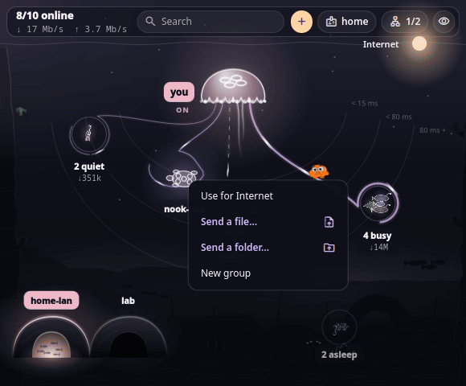

- **Ctrl+V on an open card** sends what you copied in your file manager (needs `wl-clipboard` for `wl-paste`).
- **Launcher**: `abyss send` lists *Send a file to …* for each online device (`abyss send nas` keeps one), and **`dms ipc call abyss send <device> <path>`** sends without any window. The path is absolute (or a `file://` URL); at most 100 items, and a name that is not a plain device is refused.

With no Abyss view open (no popout, Control Center or desktop view on screen), nothing is drawn: a notification says how the send went.

When Abyss cannot start a send it says why next to the creature, with a link here:

- **Device is offline**: wake it or check that it is connected to the mesh, then send again.
- **Another send is still under way**: wait for it to finish.
- **No copied file to send** (Ctrl+V): copy a file or folder in your file manager first.
- **wl-paste could not run** or **The file picker could not open**: install `wl-clipboard` or `zenity`, or use another way (the menu, Ctrl+V or the launcher).

## From the launcher

Press Super+Space and type `abyss`: "Open Abyss" opens the deep from the bar; below it, connect, choose where Internet goes out (a sun marks the one in use), and, as you type a name (`abyss vega`), copy its address or SSH to it. The same words as the search in the deep pick peers by what they are: a speed (`abyss >100ms`, `abyss <20ms`), a state (`direct`, `relay`, `slow`, `busy`), a kind (`nas`, `phones`, `vps`) or a relay (`eu`); start with `ssh`, `copy` or `send` to keep one action (`abyss ssh nas`, `abyss copy >100ms`, `abyss send nas` to pick a file for it, see [Send a file](#send-a-file)).

## Send from the launcher

Type a sentence in Super+Space, in English or French, and Abyss offers one entry: **Send a file to vega…** when the sentence names a device Abyss knows, **Send a file…** otherwise. Accents and case do not matter.

- `send file`, `send a file to vega`, `send the file to nas`, `send to vega`
- `envoie un fichier`, `envoie un fichier au nas`, `envoyer des fichiers vers vega`, `envoyer à nas`

A name is matched exactly, then by a unique start (`ve` finds `vega` if nothing else starts with `ve`); an unknown or ambiguous name gives *Send a file…* and never a guess. Only a whole sentence of this shape is taken: a timer phrase for Sands (`rappel envoyer le fichier dans 10 min`) is never claimed, and no other Abyss entry shows in a plain search. Everything else stays behind the `abyss` word (see above).

With the [Abyss app](#the-abyss-app) installed, the entry runs `abyss send vega` and the app opens on the sending; without a device it runs `abyss`. Without the app, the file picker of the widget opens instead.

**A prefix gets in the way.** Sentences only reach Abyss when the plugin has no prefix in DMS. The manifest ships `abyss`, and DMS cannot take an empty one from a manifest, so clear it once in DMS Settings → Launcher → Abyss (the plugin never writes DMS settings). The Abyss settings say so while a prefix is set. With a prefix set, everything keeps working behind it.

## The Abyss app

Abyss also runs as an app of its own, without DankMaterialShell: one window, started by the `abyss` command or from the application menu. It needs only Quickshell (`qs`). The window holds the depth gauge and three stations; their views come next (see below).

### Install and remove

From a checkout, run `./install-app.sh`. It copies the app to `~/.local/share/abyss/`, links the `abyss` command in `~/.local/bin/` (add that folder to your `PATH` if it is not there) and adds `abyss.desktop` to `~/.local/share/applications/`. Nothing outside `~/.local`, nothing needs root. `./install-app.sh --uninstall` removes exactly those and the folders it made (a marker file in the app folder remembers them); a command, an entry or a folder named `abyss` that is not Abyss's is never touched, and the install stops with a message instead of overwriting it.

### The depth gauge and the stations

The window is a dive. On the left, the **depth gauge** is a vertical scale with three round targets, one per station: **Settings** at 0 m, **Send** at 200 m and **Map** at 4 000 m. The current station is filled and ringed, and Darwin swims beside it. Under the scale, four readouts follow the depth: depth, pressure, temperature and the NetBird signal (a glyph as well as a colour: ● connected, ◐ stopped, ✕ missing, ○ unknown).

- **Switch station**: click a target, or press Tab until one is ringed and then Enter, Space or numpad Enter. The view changes with a brief dive (200 ms going down, 150 ms going up, nothing else moves); with Reduce motion on, it changes at once.
- **From the command line**: `abyss map`, `abyss settings`, `abyss send <device>` and `abyss peer <device>` land on the right station (`peer` opens the map).
- **Narrow window**: down to 900×600 the gauge narrows to 56 px and the padding to 24 px; the signal readout then shows its glyph only.
- **Settings and Send** are empty for now: only their title, until their own views land.

#### A device is not found

When the peers are read and `abyss peer <device>` names none of them, the window opens on the map with a short message and the GitHub mark that opens this section; nothing is guessed. The window does not read the peers yet (the map view comes next), so for now no device is called unknown.

### One window

`abyss` starts the app. Run it again, from anywhere, and it hands its request to the window already open instead of starting a second process. Closing the window ends the process: no tray icon, nothing left in the background. The request is delivered to that window, but Quickshell cannot bring it forward: your compositor decides, so focus it from your taskbar if it stays behind. A request the app refuses is printed by `abyss` on the error output (exit code 2).

### App command line

```sh
abyss                          # open Abyss
abyss send <device> [files…]   # send files to a device
abyss peer <device>            # open a device
abyss map                      # open the map
abyss settings [category]      # open the settings
abyss --help | --version
```

Every word is checked before anything happens, and an error is one short sentence:

- A **device** is a name: letters, digits, `.`, `_` and `-`, up to 63 characters, starting with a letter or digit.
- **Files** are made absolute from where you typed the command (`..` cannot climb above `/`), at most 100, none starting with `-` unless you put `--` before them (`abyss send atlas -- -odd.txt`). The whole disk cannot be sent.
- A **category** is lowercase letters and `-`.
- No control character anywhere, no word longer than 4096 characters, at most 110 words.

Nothing is run through a shell: the words reach the app as data only.

## Settings

| Section | Setting | Default | Description |
| --- | --- | --- | --- |
| Desktop | Screens | All | Which screens show the fishbowl |
| | Keep the desktop alive | Off | The bowl keeps moving when the pointer is away (off costs nothing) |
| The deep | Things on screen | 5 | How many creatures and groups show before the rest gather into shoals (3 to 10) |
| | Open groups | Hover and click | Hover and click, hover only, or click only. Carrying the light always opens them |
| | Show offline peers | On | Asleep on the floor, or hidden. With NetBird's lazy connections on, idle peers doze a little above the floor instead ("idle · wake on use"): NetBird does not say which of them are really off |
| | Light pulses | On | Pulses of traffic along the tentacles |
| | Companion | On | Darwin (Darwin Watterson from *The Amazing World of Gumball*, © Cartoon Network, see the README's credits), a goldfish with a life of his own: he eats the crumbs the traffic drops, scrubs the glass as it clouds over, sleeps on the bottom while the mesh is down and waves when clicked. He only moves while a view is open, and stays still with *Reduce motion* |
| Peers | Bar pill | Peers online | What the small jellyfish in the bar says beside it: how many peers are online, the total traffic, or nothing |
| | Notifications | Off | When a peer comes or goes; muted peers stay quiet |
| | Terminal for SSH | Automatic | The terminal used for SSH |
| Source | Mesh source | Automatic | Your NetBird daemon, or the test lab's made-up mesh. Automatic reads NetBird when the `netbird` command is installed |
| Test lab | Mesh | Home | Home (10 peers), work (5), crowd (30), or a custom size from 1 to 120 peers, to see how groups form |
| | Added latency | 0 ms | Added to every peer: they sink deeper and may switch places |
| | Trouble | None | A peer stops answering (raised as silent after a few minutes without a handshake), a peer keeps dropping out (every 6 s, for notifications), a relay goes down, the management server is unreachable, signed out, service stopped. Applied when chosen; the jellyfish still connects and disconnects |
| | Traffic | Normal | Calm, normal, or rush hour (pulses and totals) |
| | Lazy connections | Off | As if NetBird's lazy connections were on: idle peers doze in the water instead of sleeping on the floor |

The test lab only shows while it is the mesh source. It never touches NetBird: the mesh is made up and lives in memory. Its title sums up what is set ("48 peers · +80 ms · a peer stops answering") and *Reset* brings back the quiet home mesh.

DMS's *Reduce motion* is respected: every movement stops.

## Privacy

- **No network access by the plugin itself, no telemetry.** NetBird is read through its local `netbird` command, never through a shell: no peer name or address can run anything. QR codes are drawn locally.
- **Secrets stay secret.** A setup key goes to `netbird` through its environment, which only you can read, never on a command line (visible to every user in `ps`). It is never saved, logged or put on the clipboard. The command line takes a key file, never the key (see [Join a mesh](#join-a-mesh)).
- **Written to disk: only your settings**, saved by DMS. They hold peer names and identifiers (NetBird's key for each peer, or its name or address when it has none) for your favorites, muted peers and own groups, which peer carries each exit route once seen, and the login (user, port) you set for a peer. Live peers, addresses and traffic stay in memory for the session.
- **Clipboard tidy.** After a successful join, the copy of the setup key in DMS's clipboard history is removed (pinned entries are yours and stay).
- **Names are only names.** A peer's name is shown as plain text: it never becomes a link in a toast, and *Open page* only opens a plain host name or address.
- **Who can ask Abyss to act.** Like every DMS plugin, the `dms ipc call abyss …` commands answer programs running in your own session, the same way your keyboard shortcuts do. They can connect, disconnect or open a peer, never read a setup key.
- **Nothing in the log.** Abyss writes no peer, address or command line to the shell's journal.
- **Sending a file** runs your own `scp` once, only when you send. **Ctrl+V** on a card reads the clipboard once with `wl-paste` (the list of copied files), only on that keypress; nothing of it is kept. **Send a file…** opens `zenity`, your file picker. Paths go to these programs as arguments, never through a shell, and are never logged.
- **Local tools only**: copy uses DMS's clipboard, SSH, SFTP, VNC and RDP open your own programs, Ping runs your own `ping` to one peer of your mesh, only when you click it. The GitHub mark in help notes opens the docs in your browser, on click only.

## Performance

- Nothing runs while no view is open: no timer, no reads (one read of NetBird when the shell starts, so the bar shows the real state).
- While a view is open, NetBird is read every 2 s, one command at a time, never piled up.
- While a view is open, one 30 Hz timer moves the pulses and the marine snow; only this window redraws, never the whole shell.
- *Reduce motion* turns every movement off.

Measured numbers will be added before the first stable release.
